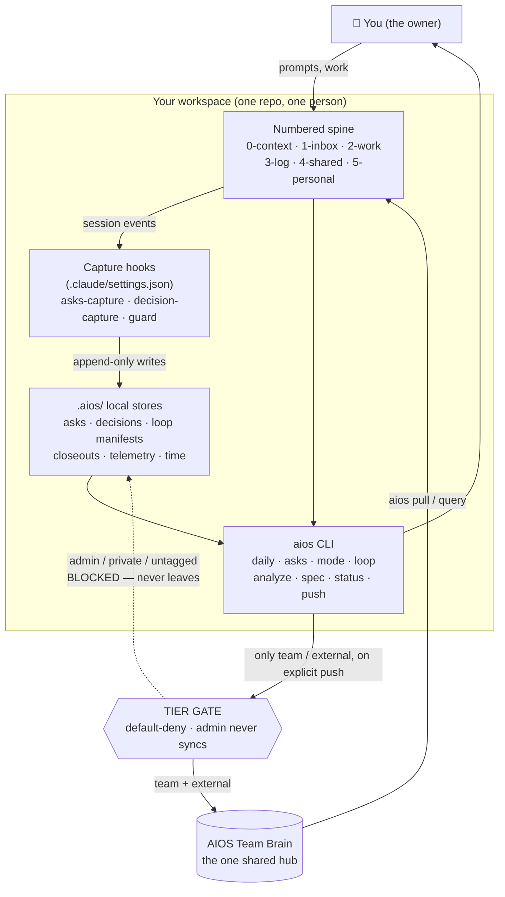
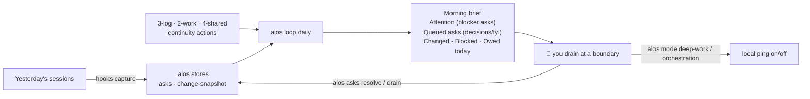
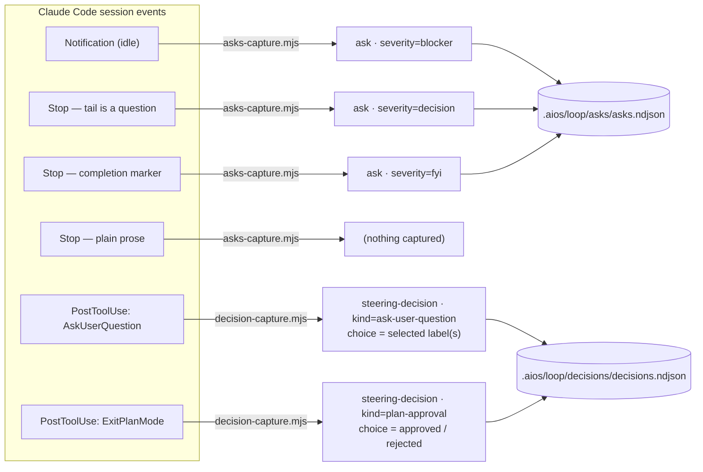
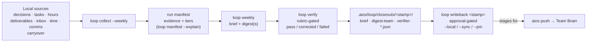
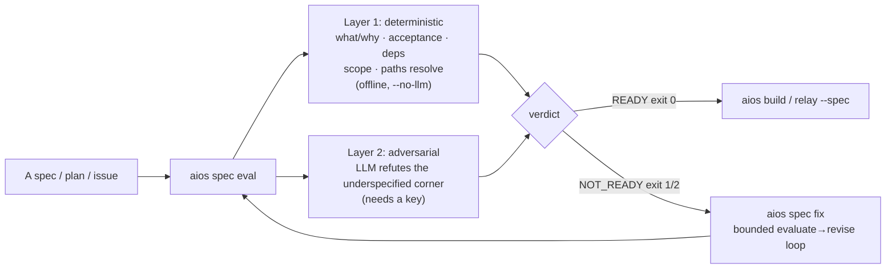
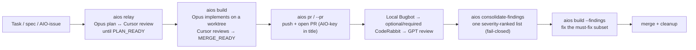

# The AIOS operating manual

This is the one document that makes the whole workspace legible in a sitting. It is written for
**the owner who has to drive this tomorrow** — organized around your day, not around the code. If
you have ever thought *"I don't actually know what all of this does or how I touch it,"* start here.

Two companion docs sit underneath this one and you rarely need them first: [`GETTING-STARTED.md`](GETTING-STARTED.md)
is the linear zero-to-first-push setup path, and [`architecture.md`](architecture.md) is the model
underneath. This guide is the map of *what you do with it once it's running*.

Everything below is verified against the current CLI (`scripts/aios.mjs`) and the shipped code.
Where a capability is planned rather than built, it says so.

---

## Contents

- [1. The mental model (one diagram)](#1-the-mental-model-one-diagram)
- [2. Two things both called "decisions" — read this once](#2-two-things-both-called-decisions--read-this-once)
- [3. Your morning: the daily brief](#3-your-morning-the-daily-brief)
- [4. Through the day: asks, mode, and how sessions feed them](#4-through-the-day-asks-mode-and-how-sessions-feed-them)
- [5. The weekly loop: collect → verify → writeback](#5-the-weekly-loop-collect--verify--writeback)
- [6. Syncing to the brain: status, push, pull, tiers](#6-syncing-to-the-brain-status-push-pull-tiers)
- [7. Measuring yourself: analyze, agentic maturity, time](#7-measuring-yourself-analyze-agentic-maturity-time)
- [8. Gating specs before you build](#8-gating-specs-before-you-build)
- [9. The agent pipeline: relay, build, ship](#9-the-agent-pipeline-relay-build-ship)
- [10. Client & repo tooling: rails, assess-codebase, learn](#10-client--repo-tooling-rails-assess-codebase-learn)
- [11. Sharing and reaching the brain from other agents](#11-sharing-and-reaching-the-brain-from-other-agents)
- [12. Command quick-reference](#12-command-quick-reference)
- [13. Where local state lives (`.aios/`)](#13-where-local-state-lives-aios)

Every `aios` command in this guide walks up from your current directory to find the workspace
(`aios.yaml`); pass `--repo <path>` to point at a different one. The *offline* commands (asks, mode,
decisions, loop, analyze, time, rails, assess-codebase, graph, export-okf, learn) need no brain
and no network — only `push`, `pull`, and `query` require a configured `brain_url` + key.
`aios spec` is offline only in deterministic `--no-llm` mode; its adversarial layer needs an API
key (§8).

---

## 1. The mental model (one diagram)

You work in one workspace. Sessions (Claude Code, cockpit, other agents) run inside it and leave
signals. Hooks and stores capture those signals locally. CLI commands read them and orient you. A
single tier gate decides what — if anything — crosses to the shared Team Brain. **`admin`/private
content never crosses.** That's the whole system.



Compact ASCII version of the same picture:

```
 you ─prompts─▶  [ spine 0..5 ]
                       │ session events
                       ▼
                 [ capture hooks ]  asks-capture · decision-capture · guard
                       │ append-only
                       ▼
                 [ .aios/ stores ]  asks · decisions · loop · telemetry · time
                       │
                       ▼
                 [ aios CLI ] ──orients──▶ you
                       │
                 only team/external, on explicit `aios push`
                       ▼
              ╔═══════════════════════╗
              ║  TIER GATE            ║   admin / private / untagged ──✗ BLOCKED
              ║  default-deny         ║       (never leaves the machine)
              ╚═══════════╤═══════════╝
                          │ team + external
                          ▼
                  ( AIOS Team Brain )  ──aios pull / query──▶ back into 1-inbox/
```

The three load-bearing invariants, in one place:

- **Local by default.** Nothing leaves your machine until *you* run `aios push`. The asks queue,
  the decision corpus, the loop stores, analyze, time — all of it is local-only.
- **Tier travels with content.** Every file/record carries an access tier: `admin` (private, never
  syncs), `team` (syncs to the brain), `external` (syncs outward). Untagged = not pushed
  (default-deny). The brain independently rejects `admin` at the boundary (HTTP 422).
- **Verification is the value.** The harnesses and the weekly loop don't just produce output — they
  produce output an independent stage has checked against evidence and tier policy.

---

## 2. Two things both called "decisions" — read this once

This trips everyone. There are **two** distinct "decision" concepts and they never mix:

| | `aios decisions` (steering decisions) | Team Brain **Decisions** |
|---|---|---|
| What it records | The agent↔you prompt moments: `AskUserQuestion` picks, plan approvals/rejections | Codified *team* decisions in your engagement/role decision log (`3-log/decision-log.md`) |
| Purpose | Training corpus for how *you* steer agents; feeds the build paradigm | The shared record of what the team decided and why |
| Where it lives | `.aios/loop/decisions/decisions.ndjson` (local) | `3-log/decision-log.md` → synced to the brain |
| Tier | Always `admin` — **never syncs** | `team` — **syncs** on push |
| You touch it via | `aios decisions list/show/outcome/export` | editing the decision log; `aios push`; the `decision-audit` harness |

> One-line rule: **`aios decisions` = how you steer the agent (private, never leaves). Team Brain
> Decisions = what the team decided (shared).** If it answers "which option did I pick when Claude
> asked me," it's the first. If it answers "what did we decide about the architecture," it's the
> second. (A rename to reduce this collision is tracked as AIO-188 — nothing is renamed yet.)

---

## 3. Your morning: the daily brief

**One command orients you for the day:** `aios loop daily`. It is read-only, offline, and answers
"what changed, what's blocked, what do I owe today" — plus, for you as the owner, it surfaces your
own asks queue at the top.



Real run against a fresh workspace:

```text
$ aios loop daily
aios loop daily  window 2026-07-02 → 2026-07-03     owner-private · local only

Changed (1)
  • deliverable 2-work   2-work/index.md

Blocked (0)

Owed today (0)
```

When you have open asks, two sections render **above** Changed: **Attention** (open `blocker` asks,
oldest first) and **Queued asks** (open `decision` then `fyi` asks). Those two sections are
owner-only — run `aios loop daily --as team` and they vanish, because asks are admin-tier and never
appear in any audience view but yours.

- **Purpose:** a low-friction daily orientation that makes the weekly closeout assembly rather than
  archaeology.
- **When to reach for it:** first thing, and any time you lose the thread of the day.
- **Output meaning:** *Changed* = files touched in the window (an owner run records a private
  change-snapshot so tomorrow's diff is meaningful). *Blocked* = tasks/decisions marked blocked.
  *Owed today* = commitments due. *Attention / Queued asks* = your escalation queue (§4).
- **Flags:** `--as team|external` (simulate a narrower audience — hides asks), `--no-record` (don't
  write the change-snapshot, text mode only — `--json` already doesn't record by default), `--record`
  (opt into writing the change-snapshot alongside `--json`), `--json`. **Recording default depends on
  mode:** text mode records by default (interactive daily check-in); `--json` does NOT record by
  default (so a repeated poller — dashboard/cron/hook — doesn't self-consume its own "changed" signal
  on the first call, AIO-365). Pass `--record --json` if you genuinely want both.

---

## 4. Through the day: asks, mode, and how sessions feed them

### The asks queue — the non-blocking escalation inbox

When an agent hits a blocker, a decision that needs you, or a "done, ready for review" moment, the
old reflex is a blocking prompt — which stalls the agent and trains you to rubber-stamp. The asks
queue is the alternative: escalations land in a **local, append-only queue** and you drain them on
your own cadence. Nothing blocks, nothing is lost.

```text
$ aios asks list
aios asks  open · 0
  (none)
```

| Command | Purpose | Reach for it when |
|---|---|---|
| `aios asks list [--status open\|resolved\|orphaned\|all]` | Show the queue (open by default) | Draining at a boundary |
| `aios asks show <id>` | Full record for one ask | You want the body/ref/source of one item |
| `aios asks resolve <id...>` | Mark ask(s) resolved (bookkeeping) | You've handled it |
| `aios asks add --kind <k> --severity <blocker\|decision\|fyi> --title <t> [--body <b>] [--ref <r>]` | Manually enqueue an ask | You want to park something for yourself |
| `aios asks drain [--keep-open]` | Orphan-detect → list → auto-resolve open → GC old closed | Inbox-zero the queue |
| `aios asks harvest [--cadence d\|w]` | Pull loop events (decisions/assignments/…) into the queue via the tier-gated comms sender | You want the loop to surface escalations, not just live sessions |

`drain` runs in a fixed order: it first *orphans* asks whose session transcript is gone (or that have
been open > 14 days), then prints what's left, then auto-resolves them (unless `--keep-open`), then
garbage-collects resolved/orphaned records older than 7 days. Severities are exactly three:
`blocker` (something is stuck), `decision` (needs your call), `fyi` (heads-up / done).

The store is `.aios/loop/asks/asks.ndjson` — append-only, admin-tier, **never synced**.

### Attention mode — silence or restore the local ping

Orchestrating a swarm of sessions makes the end-of-turn ping valuable (it's your wake-up for the
next supervision decision). Deep work makes the same ping a tax. `aios mode` is the one-command
toggle.

```text
$ aios mode
aios mode  orchestration  · local ping: default

$ aios mode deep-work        # silences the local ping
$ aios mode orchestration    # restores the prior channel
```

- **Purpose:** flip between deep-work (ping off) and orchestration (ping on) without losing your
  notification config.
- **What it actually touches:** exactly one key — `preferredNotifChannel` in
  `~/.claude/settings.json`. Deep-work sets it to `notifications_disabled`; orchestration restores
  the exact prior value (remembered in `~/.claude/aios-mode.json`), including "was unset." It
  **never** touches `agentPushNotifEnabled` — mobile push is untouched. Mode is read back *from the
  settings file*, so a hand-edit is never masked.
- **Reach for it:** entering a focus block (`deep-work`), returning to supervising many sessions
  (`orchestration`).

### How sessions feed asks and steering-decisions (capture routing)

You don't create most asks and steering-decisions by hand — hooks registered in
`.claude/settings.json` capture them from session events, deterministically (zero-LLM), and always
exit 0 so a hook can never disturb a session. This is the routing:



As a table (this is the authoritative routing):

| Session event | Detected by | Lands in | As |
|---|---|---|---|
| `Notification` (session idle, waiting on you) | `hooks/asks-capture.mjs` | asks store | ask, severity `blocker` |
| `Stop` whose last assistant turn ends on a question | `hooks/asks-capture.mjs` | asks store | ask, severity `decision` |
| `Stop` whose tail is a completion marker | `hooks/asks-capture.mjs` | asks store | ask, severity `fyi` |
| `Stop` on plain prose | `hooks/asks-capture.mjs` | — | nothing (no false asks) |
| `AskUserQuestion` tool call | `hooks/decision-capture.mjs` (PostToolUse) | decisions store | steering-decision `ask-user-question`, with the chosen label(s) |
| `ExitPlanMode` tool call | `hooks/decision-capture.mjs` (PostToolUse) | decisions store | steering-decision `plan-approval` (`approved`/`rejected`, feedback → notes) |

Both hooks are dependency-free, dedupe re-fires (per session + content), and write append-only
NDJSON under a writer-honored lock. When extraction is ambiguous (e.g. an answer shape the hook
can't parse), it captures the record with `choice: null` rather than guess.

> Scope note: these capture hooks are currently registered in *this toolkit repo's* root
> `.claude/settings.json` as the owner's dogfood. Installing them into every scaffolded workspace is
> a tracked follow-up, not yet shipped — a fresh scaffold has the `aios asks` / `aios decisions`
> CLIs but not the auto-capture hooks.

### The steering-decision corpus

```text
$ aios decisions list
aios decisions  0
  (none)
```

| Command | Purpose |
|---|---|
| `aios decisions list [--kind k] [--since date]` | The corpus, newest first (AskUserQuestion + plan-approval records) |
| `aios decisions show <id>` | Full record: question, options, your choice, notes, outcome |
| `aios decisions outcome <id> <text>` | Annotate how a decision turned out (append-only; records never mutate) |
| `aios decisions export` | Dump all records as a JSON array (the training/eval read path) |

Reach for `outcome` when a call you made pays off or backfires — annotated outcomes are what turn the
corpus into feedback. See §2 for why this is *not* the Team Brain decision log.

---

## 5. The weekly loop: collect → verify → writeback

The weekly closeout is the heavy, verified, approval-gated cadence: it closes the week *with proof*.
It collects a week of local signals, drafts a private owner brief plus tier-safe shareable digests,
runs an independent verifier over every shareable claim, and promotes only what you explicitly
approve.



The stages, in the order you'd run them:

| Command | Purpose | Output |
|---|---|---|
| `aios loop collect [--daily\|--weekly]` | Gather local work signals into a tier-tagged run manifest | `.aios/loop/manifests/` (offline, never synced) |
| `aios loop manifest --explain [--as team\|external]` | Inspect a manifest's evidence + tiers; simulate what a given audience would see | printed evidence/tier breakdown |
| `aios loop weekly [--as team\|external] [--all] [--manifest <p>]` | The closeout: private owner brief + shareable digest(s), C3-verified with bounded correction | `.aios/loop/closeouts/<stamp>/` |
| `aios loop verify --manifest <p> --ledger <p> [--as …]` | Verify a drafted ledger against evidence + tier policy | `pass` / `failed` (non-zero exit on failed); `--smoke` derives a debug ledger |
| `aios loop writeback <stamp> [--local] [--sync] [--pm]` | Approval-gated promotion of a saved closeout (default: preview) | stages files/rows for your later `aios push` |
| `aios loop telemetry [--window <days>]` | Owner-only dogfood dashboard: the six V1 exit-criteria metrics | reads `.aios/loop/telemetry/`, never synced |

The safety posture that makes this trustworthy:

- **No admin content reaches a shareable digest.** Default-deny on missing `access:`; the verifier
  checks tier policy, not just factual grounding.
- **Verification gates approval.** `loop weekly` runs the C3 verifier with bounded correction; a
  `failed` verifier is visible before you approve anything.
- **Writeback is explicit and staged.** `writeback` with no target just previews. `--local` /
  `--sync` / `--pm` each opt in one destination, and even then it only *stages* — network egress is
  still your separate `aios push`.

`--daily` in `loop collect` feeds `loop daily` (§3); the daily cadence is what keeps the weekly cheap.

---

## 6. Syncing to the brain: status, push, pull, tiers

This is the part where content actually crosses the tier gate. Nothing here fires without you.

```text
$ aios status
aios status — project 'sandbox' → <offline/standalone>

new (9):
  0-context/index.md [artifact, team]
  2-work/index.md [deliverable, team]
  3-log/decision-log.md [decision, team]
  ...
blocked (3):
  .claude/memory/MATURITY.md — `access: admin` never syncs
  .claude/memory/USER.md — `access: admin` never syncs
  .claude/memory/WORKSPACE.md — `access: admin` never syncs

clean (already synced): 0

blocked files never leave this machine. To sync one: add `access: team` (or `external`) frontmatter.
```

| Command | Purpose | When |
|---|---|---|
| `aios status [--json\|--porcelain]` | What would sync: new / modified / blocked / clean, each with tier + block reason | Before any push — always look first |
| `aios review` | Interactive push: toggle each file's inclusion, then push the selection | You want to eyeball what leaves, file by file |
| `aios push [--dry-run] [paths…]` | Push team- and external-tier content to the brain | You've reviewed status and want to send |
| `aios pull` | Fetch team updates into `1-inbox/from-brain/` (append-only) | Pulling shared context back down |
| `aios pull deliverable <path>` | Fetch one item (or a folder prefix) on demand | You need a specific shared artifact |
| `aios promote <file> [--to 2-work\|4-shared] [--dry-run]` | Anonymize-then-promote: COPY a private file (`5-personal/`, or any dir outside `sync_include`) to `2-work/` (team) or `4-shared/` (client/company), scanning the copy with the same secret + leak-gate checks as `push`, injecting `access:` frontmatter, and logging the promotion | A private draft (case study, portfolio piece, deliverable template) matures to a wider audience |
| `aios work done <key> [--push]` | Mark a task done; `--push` notifies the brain/PM sync | Closing a task from the CLI |
| `aios query "question"` | Ask the Team Brain; grounded answer with `[S#]` citations | You have a cross-team question |

The tier model, one more time (friendly label → canonical → syncs?):

| Friendly (consultant / employee) | Canonical | Syncs? |
|---|---|---|
| `private` / `private` | `admin` | **never** |
| `team` / `team` | `team` | yes — to the Team Brain |
| `client` / `company` | `external` | yes — outward-facing |

**Default-deny** is the rule: untagged content and anything `admin` never syncs, and the gate is
enforced *before* any network call (and again on the brain, which rejects `admin` with 422). The
sync gate (`buildPlan` in `scripts/aios.mjs`) is the single place these rules live.

Related read/traverse commands (all offline unless noted):

- `aios export-okf [dir] [--tier external|team]` — emit an OKF bundle (no brain needed).
- `aios pull-bundle [--include-body]` — pull the OKF link graph from the brain → `.aios/bundle.json`.
- `aios graph [--from <file>] [--depth N] [--format text|json]` — traverse the local OKF link graph.

---

## 7. Measuring yourself: analyze, agentic maturity, time

`aios analyze` scores your **agentic maturity (AM)** from your local session logs across
Claude, Codex, and Cursor — plus an *Attention* card that measures your working rhythm, and provider
spend. It's offline; raw sessions never leave the machine (`--push` shares only the scores).

```text
$ aios analyze
AIOS analyze — 2026-06-26 → 2026-07-03 (claude, codex, cursor)
  134 sessions · 1601 tasks · …

You're at Spine L5 — Agentic Orchestration — multiple agents, your own evals, feedback loops
  overall 3.20/4 · each axis scored 0–4

  Verification           ████ 4.0  does the agent check its own work?
  Context hygiene        ████ 4.0  is it working from clean, focused context?
  Autonomy / leash       ███░ 3.0  how much you let it run on its own
  Learning / compounding ███░ 3.0  does your setup get smarter over time?
  Cost & governance      ██░░ 2.0  tokens & money spent per task

  Attention — orchestration-heavy — protect focus blocks
    context switches/hr 11.32 · focus block avg 137.4m · interrupts/hr 15.00 · peak concurrent 10

  Biggest opportunity: Cost & governance — tokens & money spent per task
```

- **Purpose:** show, from real logs, how mature your agent practice is and where the next gain is.
- **Reach for it:** weekly, or when you feel your setup is thrashing.
- **Output meaning:** five 0–4 axes (Verification, Context hygiene, Autonomy, Learning, Cost &
  governance) roll up to a Spine level (L0–L5). The **Attention** card is *not* a sixth axis — it
  reads your rhythm (context switches/hr, focus-block length, session-hop interrupts, peak concurrent
  sessions) so you can tell deep work from frantic orchestration. Both feed `aios loop daily`.
- **Flags:** `--since 7d|billing`, `--tool claude|codex|cursor`, `--report` (step-by-step plan for
  the weakest axis), `--json`, `--push` (share scores + Cursor billing), `--full`.
- **`aios learn`** prescribes your next AM patterns from `MATURITY.md` (offline).

**Session pulse** — after each session, a Stop hook (`hooks/session-pulse.mjs`) prints a 2-line
pulse from the last `aios analyze` run: AM Spine/overall, the CE shadow band, your weakest axis +
its top tip, and a freshness reading — living proof that maturity monitoring runs in the
background, without running anything by hand. It's throttled to at most once every 45 minutes and
only ever reads precomputed state (no raw events, no tool names); if the state is stale (> 24h) or
missing, it says so instead of guessing. Keep the state fresh with a daily cron:

```cron
0 7 * * * cd /path/to/your/aios-workspace && npm run aios -- analyze --since 30d >> .aios/loop/analyze-$(date +\%F).log 2>&1
```

The pulse's freshness line ("measured 3h ago") is the proof the cron is alive — if it starts
reading "stale", the cron stopped running.

**Time tracking** derives agent-runtime work blocks from your `~/.claude` session logs — no manual
timer:

| Command | Purpose |
|---|---|
| `aios time capture [--dry-run]` | Derive native agent-session runtime → admin-tier `3-log/time-log.md` (realpath-scoped by `.aios/time-config.json`; never syncs) |
| `aios time report [--window daily\|weekly]` | Local runtime-by-tag from the store (read-only) |
| `aios time reconcile --id <a,b> [--set-tag t] [--set-tier t] [--confirm]` | Confirm/correct rows (confirmed rows are immutable) |

---

## 8. Gating specs before you build

Before a builder (you or an agent) picks up a spec, run it through the spec gate. `aios spec eval`
grades it against the spec-readiness rubric in two layers; `aios spec fix` iterates it to ready.



Real deterministic-only run:

```text
$ aios spec eval docs/agentic-ergonomics/spec-readiness.md --no-llm
── spec eval: docs/agentic-ergonomics/spec-readiness.md ──
  [SR1/blocker] no what/why: the behavior and the reason it matters are not stated
  [SR4/blocker] dependencies not declared — state which slices must land first, or "Deps: none"
  [SR5/blocker] scope/deferred not stated — declare what is in and what is cut
  verdict: NOT_READY   score: n/a   exit: 1
```

- **Purpose:** enforce the "pick-up-able issue" test — *an agent with no conversation history can
  read the spec and start correctly.*
- **Reach for it:** before handing any spec to `aios build`, `aios relay`, or a teammate.
- **Exit codes:** `0` READY · `1` deterministic must-fail · `2` adversarial blocker · `3`
  NOT_EVALUATED (deterministic-clean, LLM layer skipped via `--no-llm`) · `4` usage/IO error. The
  **verdict** is the gate; the 0–100 score is advisory. (The one-line `aios --help` summary shows
  `0/1/2/3` and omits 4 — the authoritative table is [`spec-readiness.md`](agentic-ergonomics/spec-readiness.md).)
- **`aios spec fix <file> [--budget N] [--write | --out <path>]`** runs the bounded
  evaluate→revise→re-evaluate loop; by default it writes `<name>.improved.md` and never touches the
  original unless you pass `--write`.
- **Relay gate:** `aios relay "task" --spec <file>` evaluates the spec *before* planning and refuses
  if it's NOT_READY — it never auto-fixes.

---

## 9. The agent pipeline: relay, build, ship

This is the build machinery: an Opus builder reviewed by an independent Cursor/GPT reviewer, run on a
dedicated worktree, gated on your approval at the plan and merge boundaries. It's how issues get
shipped without you babysitting every keystroke.



| Command | Purpose |
|---|---|
| `aios relay "task" [branch]` | Opus 4.8 ↔ Cursor plan/review loop until `PLAN_READY`; `--build` hands the plan straight to build |
| `aios build <plan-file\|task> [branch]` | Implement a plan with Opus, reviewed by Cursor, until `MERGE_READY`; `--merge` / `--pr` / `--bugbot` |
| `aios ship AIO-<n>` | The whole gated loop for one issue: recon → plan → build → PR → review → fix → merge → cleanup, behind plan + merge gates (both default ON) |
| `aios pr [--branch b] [--issue AIO-n]` | Push the branch + open a PR idempotently (prints `PR_NUMBER`; carries the `AIO-<n>` key so board automations fire) |
| `aios consolidate-findings --pr <n> --issue AIO-<n> --local-bugbot-review <path>` | Merge CI + exact-head Local Bugbot + current-head CodeRabbit + GPT reviews + the PR diff into one severity-ranked, fail-closed finding list |
| `aios review-bugbot [branch]` | Local Cursor Bugbot on a build worktree's diff (offline) |
| `aios roadmap-run (--label\|--epic\|--project)` | Unattended serial walker: ship one unblocked issue at a time; deterministic digest each run |

Start with `aios ship AIO-<n> --dry-run` — it prints the step plan offline with no API key, so you
can see exactly what the loop will do before spending a run. The full contract (every flag, the
`SHIP_EXIT` table, the per-step model config, the overnight/Hermes runbook) lives in
[`agent-build.md`](agent-build.md) and [`workflows.md`](workflows.md); the fenced-builder safety
posture (no-push policy, primary-checkout tripwire, `ANTHROPIC_API_KEY` stripped from the builder
child) is documented there too.

---

## 10. Client & repo tooling: rails, assess-codebase, learn

These score and harden *any* repo for agent work — built for standing up a fresh client repo without
hand-auditing a thousand permission prompts.

**`aios assess-codebase [path]`** scores a repo's agent-readiness (AM) offline and read-only:

```text
$ aios assess-codebase .
Agent-readiness: /Users/…/aios-workspace
  Level L5 — Self-improving  (83.33% of checks, 15/18)
    ✓ Agent instructions (4/4)
    ✓ Testing & verification (2/2)
    ✓ Build & validation guardrails (2/2)
    • Documentation (2/3)
    ✗ Observability (0/1)
    ✗ Evals (0/1)
```

**`aios rails`** manages a repo's *permission rails* — the allowlist that pre-approves safe, repeated
tool calls, and the backlog of guardrails a repo still lacks. The flow is deliberately
**suggest → review → apply**, and `apply` only ever touches `permissions.allow` — it can never
disable a guard hook.

```text
$ aios rails missing
Missing rails — /Users/…/sandbox
  agent-readiness: L0 — Pre-functional
  6 rail(s) absent (priority order):
    ✗ Permission allowlist (.claude/settings.json → permissions.allow)
        → run `aios rails suggest` then `aios rails apply`
    ✗ Leak gate (confidential-term guard)
    ✗ Test suite
    ...
```

| Command | Purpose |
|---|---|
| `aios rails missing [--repo <path>]` | List absent rails (allowlist, guards, leak-gate, tests, CI…), priority-ordered, each with a how-to pointer |
| `aios rails suggest [--repo <path>] [--min-count N]` | Propose a **safe** `permissions.allow` from the transcript log; a hardcoded denylist excludes dangerous commands. **Never writes.** |
| `aios rails apply [--repo <path>] [--dry-run] [--from <json>]` | Merge proposals into `.claude/settings.json` (allow-only; every other key untouched; `--dry-run` prints the diff) |

Typical use on a fresh client repo: `rails missing` → `rails suggest` → `rails apply --dry-run` →
`rails apply`. The allowlist is one rail of several — add the CLAUDE.md, a PreToolUse guard, and a
leak gate that `missing` named. Guards and human review still gate everything; an allowlist only
speeds up *safe repetition*.

---

## 11. Sharing and reaching the brain from other agents

**Sharing skills and artifacts across the team** (via the brain):

| Command | Purpose |
|---|---|
| `aios push skill <name>` | Publish a skill (`SKILL.md` + references) to the brain |
| `aios pull skill <name>` | Fetch a shared skill → `1-inbox/from-brain/skills/<name>/` |
| `aios install-skill <name> [--force]` | Promote a pulled skill into `.claude/skills/` (explicit — pulled skills never auto-activate) |
| `aios push blueprint` / `aios pull blueprint` | Publish / fetch the team's tool set (lead/admin only to publish) |
| `aios skills export --runtime <name>` | Export skills to another agent runtime (BYOA: claude-code, hermes, openclaw, codex, opencode, claude-api) |

**Setup / onboarding:**

- `aios onboard` — guided first-run setup (Firecrawl, brain, tools).
- `aios connect [<id>]` — connect an integration, guided and live-validated (`--token` / `--set ENV=v`
  for non-interactive).
- `aios skills` — list the workspace's skills.

**Reaching the brain from a shell-less agent — `aios mcp` (built, read-only):** agents that can't
shell out (Claude Desktop, Cowork, Codex, Conductor) reach the brain through `aios mcp`, a stdio MCP
server bridge (`scripts/brain-mcp.mjs`). It's intentionally **thin and read-only** — it wraps the v1
read endpoints and reuses the brain's server-side tier filtering as its safety boundary, and needs no
workspace (config is env-first). The tool surface: `brain_status`, `brain_query`,
`brain_list_projects`, `brain_list_tasks`, `brain_list_decisions`, `brain_pull_items`,
`brain_get_item`, and `aios_loop_collect`. What is **built today** is this Phase-0 stdio server plus
the `aios mcp` command; what is still **planned** (in the same PRD) is the one-click `.mcpb` desktop
bundle, an `npx` distribution, and write/push support — so the current bridge validates the protocol
but does not yet deliver the "no terminal, ≤5 min" desktop experience. Design + phasing:
[`prd-team-brain-mcp-connector.md`](prd-team-brain-mcp-connector.md).

> Don't confuse the **MCP bridge** (which *AI surfaces* can reach the brain) with **BYOA** (which
> *agent runtimes* can run the local harness — `aios skills export`, the runtime adapters). Different
> lever, different layer. See [`byoa.md`](byoa.md).

---

## 12. Command quick-reference

Every current subcommand, one line each. Offline = no brain/network needed.

**Brain sync**
- `aios status` — what would sync (new/modified/blocked/clean). *(needs brain config to name a target; classification is offline)*
- `aios review` — interactive toggle-then-push.
- `aios push [--dry-run] [paths…]` — push team/external content.
- `aios pull` / `aios pull skill <n>` / `aios pull deliverable <p>` — fetch brain updates.
- `aios work done <key> [--push]` — mark a task done.
- `aios query "…"` — ask the brain (grounded, cited).

**Daily / attention (offline)**
- `aios loop daily` — morning brief.
- `aios asks list/show/resolve/add/drain/harvest` — escalation queue.
- `aios mode [status|deep-work|orchestration]` — local ping toggle.
- `aios decisions list/show/outcome/export` — steering-decision corpus.

**Weekly loop (offline)**
- `aios loop collect [--daily|--weekly]` — run manifest.
- `aios loop manifest --explain` — inspect evidence + tiers.
- `aios loop weekly` — verified closeout.
- `aios loop verify` — verify a ledger.
- `aios loop writeback <stamp>` — approval-gated promotion.
- `aios loop telemetry` — six V1 exit-criteria metrics.

**Measure (offline)**
- `aios analyze` — AM + Attention + spend.
- `aios learn` — next-pattern prescription.
- `aios time capture/report/reconcile` — agent-runtime time.

**Specs (offline; adversarial layer needs a key)**
- `aios spec eval <file>` — grade a spec.
- `aios spec fix <file>` — iterate to ready.

**Agent pipeline**
- `aios relay "task"` — plan/review loop.
- `aios build <plan|task>` — implement + review.
- `aios ship AIO-<n>` — whole gated loop (`--dry-run` offline).
- `aios pr` / `aios consolidate-findings` / `aios review-bugbot` / `aios roadmap-run` — PR/review machinery.

**Repo tooling (offline)**
- `aios assess-codebase [path]` — agent-readiness score.
- `aios rails missing/suggest/apply` — permission rails.

**Sharing / graph / setup**
- `aios push skill` / `aios push blueprint` / `aios pull blueprint` — share tool sets.
- `aios install-skill <n>` — promote a pulled skill.
- `aios skills` / `aios skills export --runtime <n>` — list / BYOA export.
- `aios export-okf` / `aios pull-bundle` / `aios graph` — OKF bundles + link graph.
- `aios onboard` / `aios connect [<id>]` — setup + integrations.
- `aios mcp` — read-only MCP bridge to the brain (for shell-less agents).

Run `aios` (no args) or `aios --help` for the live usage text — it is the source of truth if this
guide and the CLI ever disagree.

---

## 13. Where local state lives (`.aios/`)

Everything the loop, asks, decisions, telemetry, and time features write is under `.aios/` in your
workspace — local, append-only where it's a store, and **gitignored / never synced** unless a command
explicitly stages it for `aios push`.

```
.aios/
├── loop/
│   ├── asks/asks.ndjson            # asks queue (admin, never syncs)   §4
│   ├── decisions/decisions.ndjson  # steering-decision corpus (admin)  §2, §4
│   ├── manifests/                  # loop collect run manifests        §5
│   ├── closeouts/<stamp>/          # weekly brief + digests + verifier §5
│   ├── continuity/actions.json     # carry-over / next-week actions    §5
│   ├── telemetry/                  # six V1 exit-criteria metrics       §5
│   └── <issue>/findings-r<N>.md    # consolidated PR findings           §9
├── loop-models.yaml                # per-step model/effort config (pipeline) §9
├── bundle.json                     # pulled OKF link graph (pull-bundle) §6
├── blueprint.json                  # pulled team tool set                §11
└── time-config.json                # realpath allowlist for time capture §7

~/.claude/settings.json             # preferredNotifChannel — toggled by aios mode  §4
~/.claude/aios-mode.json            # sidecar remembering the prior ping value       §4
```

The rule to remember: if a store lives here, it's yours and it's private. It reaches the brain only
when a tier-tagged file in the spine (`0-context`, `2-work`, `3-log`, `4-shared`, `.claude/memory`)
is pushed — never because it sat in `.aios/`.
</content>
</invoke>
